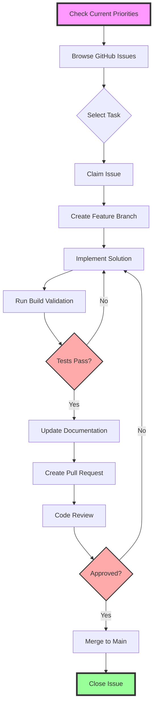
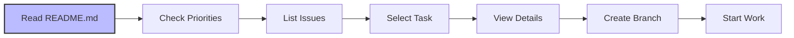
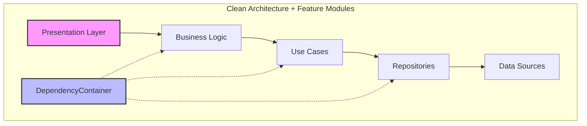
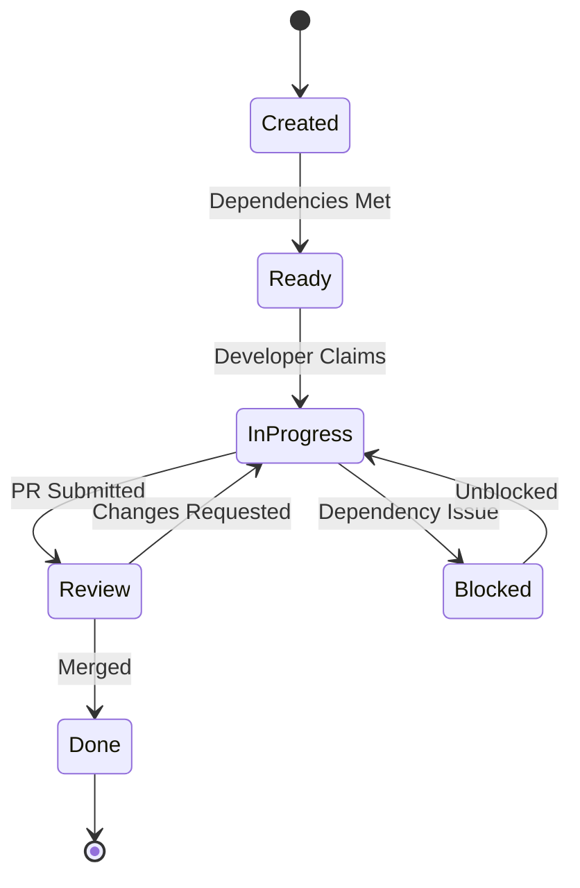
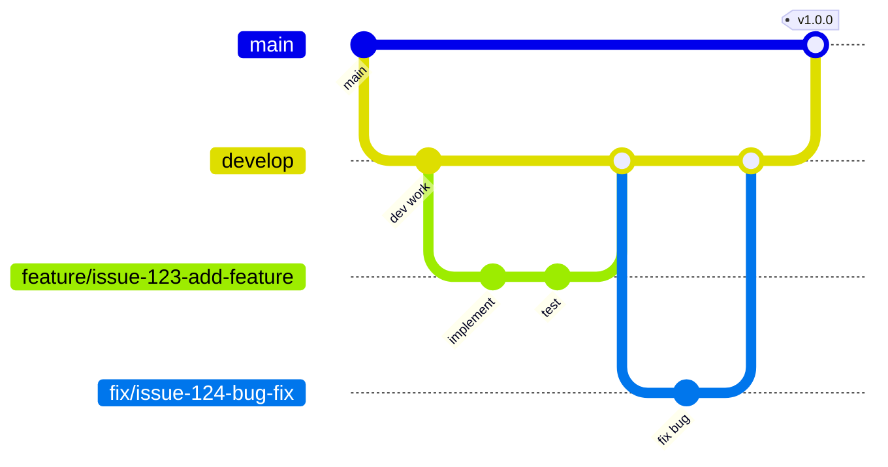
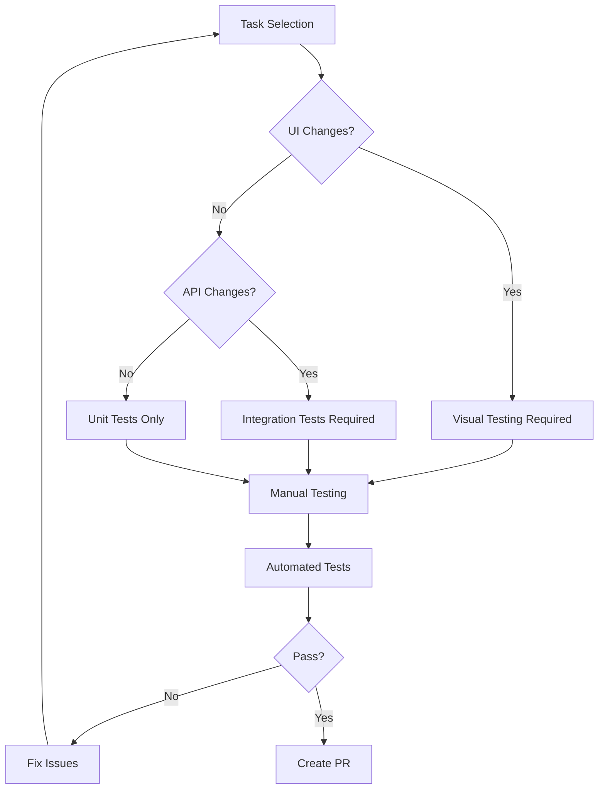
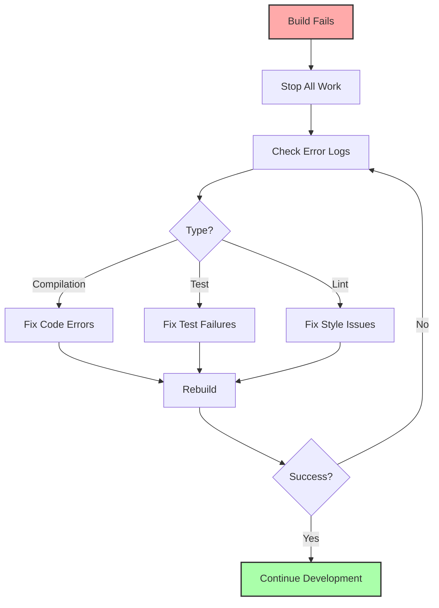

# Contributing to AI Starter Kit

Welcome to the project! This guide explains our development workflow, GitHub Issues process, contribution standards, and the comprehensive GitHub automation included in this starter kit.

## 📚 Table of Contents
- [GitHub Automation](#github-automation)
- [Essential Reading](#essential-reading)
- [Development Workflow Overview](#development-workflow-overview)
- [Project Glossary](#project-glossary)
- [GitHub Issues Workflow](#github-issues-workflow)
- [Development Commands](#development-commands)
- [Architecture Patterns](#architecture-patterns)
- [Issue Creation Standards](#issue-creation-standards)
- [Branch Strategy](#branch-strategy)
- [Testing Requirements](#testing-requirements)
- [Success Metrics](#success-metrics)

## 🤖 GitHub Automation

This starter kit includes battle-tested GitHub automation from production projects:

### Issue Templates (`.github/ISSUE_TEMPLATE/`)
1. **Bug Report** - Standard bug reporting with reproduction steps
2. **Feature Request** - New feature proposals
3. **Design Implementation** - UI/UX implementation tasks
4. **Newcomer Standard Issue** - Detailed task template with full context
5. **Parent Issue** - Epic/milestone tracking for multi-day work

All templates include mandatory CRITICAL_CORE.mdc reading requirement.

### Automated Workflows (`.github/workflows/`)
1. **validate-issues.yml** - Ensures proper issue formatting and labels
2. **assignment-check.yml** - Manages assignments (max 3 active per person)
3. **branch-naming.yml** - Enforces conventions: `feature/`, `fix/`, `docs/`
4. **project-automation.yml** - Updates project boards automatically
5. **stale-check.yml** - Flags inactive issues/PRs (30 days)

### How to Use the Automation
- **Creating Issues**: Use templates via "New Issue" button
- **Branch Names**: Must match pattern (e.g., `feature/issue-123-add-login`)
- **PRs**: Automatically link when branch includes issue number
- **Assignments**: Limited to prevent overcommitment
- **Labels**: Applied automatically based on template

### Setup Branch Protection
Run the included script to set up branch protection:
```bash
.github/scripts/setup-branch-protection.sh
```

## 🚨 Essential Reading

**MANDATORY READING ORDER:**
1. **FIRST**: Read [.cursor/rules/CRITICAL_CORE.mdc](.cursor/rules/CRITICAL_CORE.mdc) - Universal development principles
2. **SECOND**: Read this CONTRIBUTING.md guide completely
3. **THIRD**: Check [README.md](README.md) for current priorities

## 🔄 Development Workflow Overview



## 📚 Project Glossary

### Development Workflow Terminology
- **"non-critical update"** → Rule improvements or enhancements that don't require user verification
- **"core/critical update"** → Code changes affecting functionality that need user testing
- **"build validation"** → Compilation testing before task completion
- **"user verification"** → Functional testing confirmation before marking tasks done
- **"interruption context"** → Information available when user stops ongoing process
- **"high-priority ready"** → Issues that are unblocked and need immediate attention

### Task Management Terminology
- **"surface it but implement it"** → Show rule improvement opportunity AND execute the change
- **"don't need to ask"** → Proceed with implementation for non-critical improvements

### [Add Your Project-Specific Terms Here]
- **"[term]"** → [definition]
- **"[term]"** → [definition]

## 🏗️ GitHub Issues Workflow

### 📋 Before Starting Any Development Work



1. **MANDATORY**: Read the full README.md - especially Development Guide & Current Priorities sections
2. Check available high-priority tasks: `gh issue list --label "high-priority,ready"`
3. Select appropriate task based on dependencies and your expertise
4. View full issue details: `gh issue view <number>` - check subtask progress
5. Create feature branch: `git checkout -b feature/issue-<number>-description`
6. Execute work following core rules in `.cursor/rules/CRITICAL_CORE.mdc`
7. **CRITICAL**: Update issue with progress after EACH subtask

### 🔄 GitHub Workflow Efficiency

**Commit Format**:
```bash
git commit -m "feat|fix|docs|refactor|test: Description #<number>"
```

**PR Linking**: Include "Fixes #<number>" in PR description for auto-close

**Progress Updates**: 
- Comment on issue after EACH subtask completion
- Include what was done, current status, and next steps
- Update issue labels if status changes (e.g., add "needs-review")

### 📝 Issue Progress Template

```markdown
## Progress Update

### ✅ Completed
- [Subtask name]: [Brief description of what was done]

### 📊 Current Status
- Build: ✅ Passing / ❌ Failing
- Tests: [X/Y passing]
- Violations: [X remaining]

### 🔄 Next Steps
- [Next subtask to tackle]

### 💡 Notes
- [Any blockers or important findings]
```

## 🛠️ Development Commands

### Frontend Development
```bash
# Install dependencies
npm install  # or yarn install

# Run development server
npm run dev  # or yarn dev

# Build for production
npm run build  # or yarn build

# Run tests
npm test  # or yarn test

# Lint and format
npm run lint  # or yarn lint
npm run format  # or yarn format
```

### Backend Development
```bash
# Setup environment
python3 -m venv .venv  # or python -m venv .venv
source .venv/bin/activate  # On Windows: .venv\Scripts\activate
pip install -r requirements.txt

# Run development server
python app.py  # or flask run, or django runserver, etc.

# Run tests
pytest  # or python -m pytest
# or python manage.py test (Django)

# Linting and type checking
python -m flake8 .  # or pylint
python -m mypy .  # type checking
```

### Git Commands
```bash
# Create feature branch
git checkout -b feature/issue-<number>-<description>

# Safe commit with proper message
git add .
git commit -m "feat: Implement [feature] #46"

# Push and create PR
git push -u origin feature/issue-46-[description]
gh pr create --title "Fix [description]" \
  --body "Fixes #46"
```

## 🏛️ Architecture Patterns

### [Your Project Architecture]


- **Clean Architecture**: Strict layer separation
- **Feature Modules**: Independent feature development
- **[Your Pattern]**: [Description]
- **Repository Pattern**: Data access abstraction
- **Dependency Injection**: Centralized dependencies

### Key Patterns to Follow
1. **Build Validation**: Run validation scripts before commits
2. **Test Coverage**: Maintain high test coverage
3. **Documentation**: Update docs with code changes
4. **Code Review**: All changes require review

## 📋 Issue Creation Standards

### Issue Lifecycle


### 🎯 Mandatory Issue Creation Rules

- **NEVER** create monolithic issues that require deep project knowledge
- **ALWAYS** break large issues into 1-2 day subtasks
- **ENFORCE** self-documenting issue format with full context
- **ENSURE** file boundaries prevent merge conflicts

### ✅ Issue Template

```markdown
# [Feature Area] Step X: Specific Task Description

## 🎯 Overview
**Parent Issue**: #[number] (if applicable)
**Blocks**: #[numbers] (issues that depend on this)
**Depends On**: #[numbers] (issues this needs first)
**Estimated Time**: 1-2 days
**Difficulty**: Easy/Medium/Hard

## 📍 Context for Newcomers
[2-3 sentences explaining what this feature is and why we're doing this.
Assume the reader has never seen this codebase before.]

## 📂 Files to Create/Modify
### New Files to Create:
- `path/to/file.ext` - [What this file does]

### Files to Modify:
- `path/to/existing.ext` - [What changes needed]

## ✅ Acceptance Criteria
- [ ] Specific measurable outcomes
- [ ] Build passes without warnings
- [ ] Tests added/updated
- [ ] Documentation updated

## 🏗️ Implementation Guide
[Step-by-step with code examples]

## 🧪 Testing Instructions
[How to verify it works]

## 🚫 Out of Scope
[What NOT to do in this issue]
```

## 🌿 Branch Strategy

### Branch Naming Convention


**Required Format**: `{type}/issue-{number}-{description}`

**Types**:
- `feature/` - New functionality
- `fix/` - Bug fixes
- `docs/` - Documentation only
- `refactor/` - Code improvements
- `design/` - UI/UX implementation

**Examples**:
```bash
feature/issue-46-user-authentication
fix/issue-52-validation-error
docs/issue-61-readme-update
refactor/issue-37-cleanup-architecture
design/issue-8-responsive-layout
```

## 🧪 Testing Requirements

### Task Selection Flowchart


### Required Testing Matrix
| Feature Type | Unit Tests | Integration | E2E | Manual |
|-------------|------------|-------------|-----|---------|
| New Feature | ✅ Required | ✅ Required | Recommended | ✅ Required |
| Bug Fix | ✅ Required | Recommended | If UI | ✅ Required |
| Refactor | ✅ Required | ✅ Required | If affected | Recommended |
| Docs | N/A | N/A | N/A | ✅ Required |

### Validation Commands
```bash
# Run all tests
npm test  # or yarn test, or pytest, etc.

# Run specific test suite
npm test -- [pattern]  # or pytest path/to/test

# Check code coverage
npm run coverage  # or pytest --cov

# Lint checks
npm run lint  # or flake8, or your linter
```

## 📊 Success Metrics

### Performance Targets
- **App Launch**: <2 seconds
- **Page Load**: <3 seconds  
- **API Response**: <300ms average
- **Build Time**: <2 minutes
- **Test Suite**: <5 minutes

### Quality Metrics
- **Test Coverage**: 85%+ for critical paths
- **Code Review**: 100% of PRs reviewed
- **Documentation**: Updated with every feature
- **Lint Pass Rate**: 100%

### Developer Experience
- **Issue Clarity**: New developer can start without questions
- **Build Success**: First-time setup works
- **PR Turnaround**: <48 hour review cycle
- **Conflict Rate**: <5% of PRs have merge conflicts

## 🚨 Development Protocols

### Build Failure Recovery


### Bug Fix Validation Protocol
- **NEVER** mark bug fixes complete without reproducing the original issue
- **ALWAYS** verify fixes with real-world testing using actual user scenarios  
- **IMMEDIATELY** revert to investigation phase if logs show continued issues
- **REQUIRE** measurable improvement evidence before claiming fix success
- **TEST** fixes under identical conditions that caused original failure

### Task Completion Requirements
- **Build passes successfully** ✅
- **User has verified functionality** ✅  
- **No regressions introduced** ✅
- **All subtasks properly completed** ✅
- **Bug fixes validated with evidence** ✅
- **README.md updated with changes** ✅

### Documentation Update Protocol
- **ALWAYS** update README.md with every commit that changes functionality
- **NEVER** commit code changes without corresponding documentation updates
- **IMMEDIATELY** reflect architectural changes, new features, and workflow modifications
- **MAINTAIN** README currency as non-negotiable development requirement

## 🤖 Automated Enforcement

### GitHub Actions
- **Issue Validation**: `.github/workflows/validate-issues.yml`
- **Assignment Check**: `.github/workflows/assignment-check.yml`
- **Branch Naming**: `.github/workflows/branch-naming.yml` (enforces conventions)
- **Build Validation**: Runs on every PR
- **Test Coverage**: Automated checks

### Validation Rules
- Issues must follow Newcomer Standard template
- PRs must reference an issue
- Branch names must follow convention
- All CI checks must pass
- Documentation must be updated

## 🎯 Getting Started

1. Read the [README.md](README.md) for project overview
2. Check [CLAUDE.md](CLAUDE.md) for AI assistant context
3. Review `.cursor/rules/CRITICAL_CORE.mdc` for development patterns
4. Browse open issues: `gh issue list --label "high-priority,ready"`
5. Create your feature branch and start contributing!

Welcome to the team! 🚀